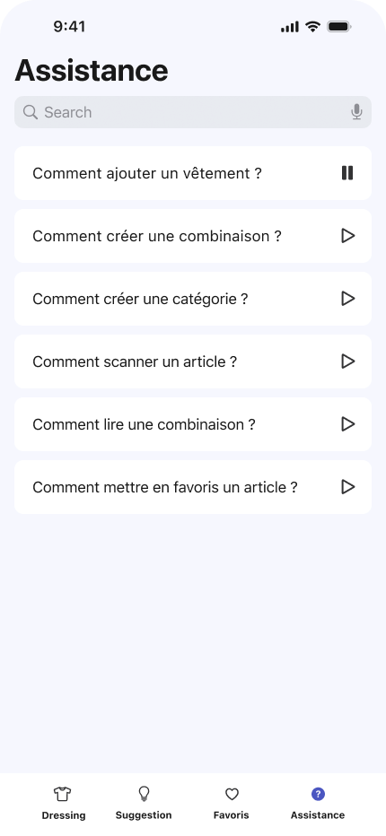

Cachemire est un prototype d'application iOS conçu pour offrir une assistance vocale aux personnes aveugles et malvoyantes dans la gestion de leur garde-robe. Bien qu'il s'agisse d'une démonstration technologique et que l'application ne soit pas pleinement fonctionnelle, Cachemire vise à illustrer le potentiel des interfaces vocales dans l'amélioration de l'accessibilité pour tous.

## Fonctionnalités

- **Listage Vocal :** Les utilisateurs peuvent explorer le contenu de leur dressing à l'aide de commandes vocales intuitives, permettant une navigation facile et sans effort.

- **Tri par Catégorie :** Cachemire permet de trier les articles vestimentaires par catégorie, facilitant ainsi la recherche et l'organisation des vêtements.

- **Gestion des Favoris :** Les utilisateurs peuvent marquer leurs articles préférés pour un accès rapide et pratique.

- **Suggestions Personnalisées :** Cachemire offre également des suggestions basées sur les préférences individuelles des utilisateurs, les aidant à découvrir de nouveaux styles ou à assortir leurs tenues.

## Autonomie Personnelle

En offrant une méthode conviviale et accessible pour gérer leur garde-robe, Cachemire vise également à accroître l'autonomie des utilisateurs. En réduisant la dépendance occasionnelle à d'autres personnes pour choisir leurs vêtements, l'application permet aux utilisateurs de gagner en indépendance dans leur quotidien.

## Équipe de Développement

Cachemire a été réalisé avec la collaboration de :
- Amandine
- Aïssatou
- Anahi
- Nathalie
- Lahrim

## Projet Open Source

Cachemire est un projet open source, conçu dans un esprit de collaboration et d'innovation. Bien que la version actuelle soit limitée à une démonstration, nous encourageons les contributeurs de tous horizons à participer au développement et à l'amélioration de l'application. En ouvrant le code source, nous espérons susciter l'intérêt et l'engagement de la communauté pour rendre l'accessibilité vestimentaire encore plus accessible.

**Remarque :** Cachemire est actuellement un prototype démo qui ne sera pas poursuivi dans son développement par notre équipe. Cependant, nous sommes ouverts à l'idée que d'autres personnes intéressées par le projet puissent le reprendre et le développer davantage. Nous encourageons toute personne intéressée à contribuer à faire évoluer cette initiative et à en explorer les possibilités.

## Aperçu

